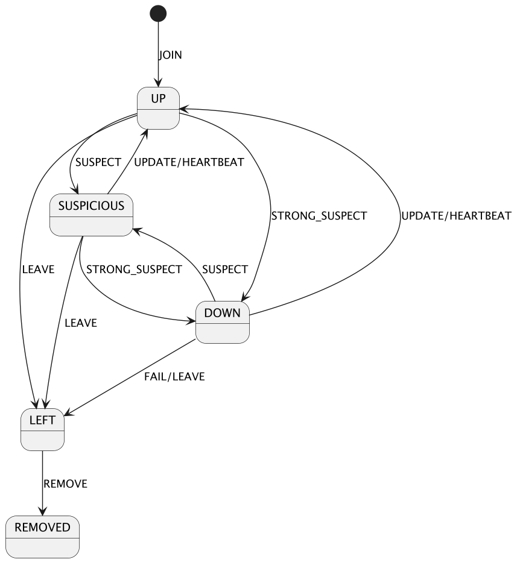
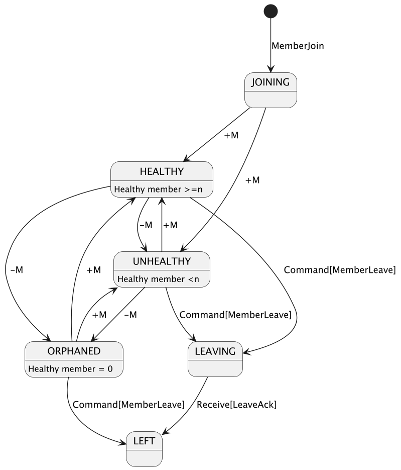

# Axor-Cluster 模块内部原理详细介绍

`axor-cluster`模块特别设计用于构建去中心化、高容错性和高可用性的集群。本模块采用了一系列先进的分布式系统技术来实现其
目标，包括Gossip协议与SWIM（Scalable Weakly-consistent Infection-style Process Group Membership）协议等。
此外，在数据一致性方面，`axor-cluster` 通过向量时钟(Vector Clock)机制进行了优化处理，以应对可能的数据冲突问题。

## 集群成员状态管理：Gossip 协议

### Gossip 协议概述

Gossip 协议是一种基于消息传递的分布式通信模式，它模仿了人类社会中的“谣言传播”方式。在分布式系统中，每个节点定期随机
选择其他节点交换信息，这样可以有效地传播信息而不需中央控制节点。Gossip协议具有良好的扩展性、鲁棒性和自愈能力，非常适
合大规模 分布式系统的状态同步需求。

### 推拉模式结合

在 `axor-cluster` 中，为了提高效率和可靠性，采用了定时心跳以及推(Push)和拉(Pull)两种模式相结合的方式进行状态更新：

- **定时心跳**：节点定时向其他节点随机发送心跳信息，心跳中包含了该节点所记录的各个成员的最新向量时钟信息。
- **Push模式**： 当一个节点检测到本地状态发生变化时，主动将变更信息发送给其他节点。
- **Pull模式**：当节点A接收到来自节点B的心跳或者Push消息时，通过向量时钟判断本地是否存在过期的状态，如果存在则向节点B发送Pull请求拉取变更信息；

这种组合使用使得即使在网络条件较差的情况下也能保证较好的状态同步效果。

### 成员状态机

#### 集群视图状态机

如下图所示，展示了 `axor-cluster` 内部使用的成员状态机模型，定义了节点之间可能的状态转换逻辑：

##### 成员状态

下面是成员各个状态的介绍

- **UP**：表示节点处于正常工作状态；
- **SUSPICIOUS**：当某个节点长时间未收到心跳信号或其他更新时进入此状态，表示怀疑该节点可能存在故障；
- **DOWN**：当某个节点长时间未收到心跳信号或其他更新时进入此状态，但还无法确定该节点是否会恢复；
- **LEFT**：节点主动离开集群或者确认节点故障且彻底无法恢复；
- **REMOVED**：节点被从集群配置中移除。

##### 状态转移事件

下面是触发成员状态切换的各个事件的解释说明

| 转移事件           | 触发条件                       | 备注            |
|----------------|----------------------------|---------------|
| UPDATE         | 本地状态更新                     | 增量传播与全量拉取混合模式 |
| HEARTBEAT      | 定时发送                       |               |
| SUSPECT        | 初次探测到通信异常，例如心跳超时，连接断开      | SWIM 间接确认机制   |
| STRONG_SUSPECT | 多个节点多次探测失败达到一定阈值           | SWIM 间接确认机制   |
| FAIL           | 多个节点多次探测失败达到最大阈值           | SWIM 间接确认机制   |
| LEAVE          | 节点主动离开                     |               |
| REMOVE         | 墓碑标记超过 TTL（默认 72 小时）后的垃圾回收 | 基于时间窗口的惰性删除策略 |

### 本地视图状态机

如下图所示，展示了本地应用所看到的本地节点加入集群后的状态变化和转换逻辑，
其中`+M`表示增加成员，`-M`表示减少成员：

##### 本地状态

下面是本地状态的介绍

- **JOINING**：表示节点正在尝试加入集群；
- **HEALTHY**：节点已经成功加入集群，并且集群健康成员数量达到最低要求；
- **UNHEALTHY**：节点已经成功加入集群，但集群健康成员数量未达到最低要求，可能存在网络分区；
- **ORPHANED**：集群中只有该节点，可能存在网络分区；
- **LEAVING**：节点正在尝试离开集群；
- **LEFT**：节点收到的来袭其他节点的ack确认信息后正式离开集群。

### 故障探测：SWIM 协议

为了快速准确地检测出网络中的故障节点，`axor-cluster` 引入了 SWIM 协议。SWIM是一种轻量级且高效的故障检测算法，
通过周期性的心跳检查以及对疑似故障节点的多轮次验证来提高故障检测的准确性。

#### SWIM 协议的工作原理

1. **心跳检测**：
    - 每个节点定期向其他节点发送心跳消息。
    - 如果某个节点在一段时间内没有收到另一个节点的心跳消息，则该节点会被标记为可疑状态（SUSPICIOUS）。

2. **间接确认机制**：
    - 当一个节点被标记为可疑状态时，其他节点会尝试通过间接的方式确认该节点的状态。
    - 具体来说，节点A会询问其他节点B是否收到了来自可疑节点C的消息。如果多个节点都报告未收到C的消息，则C节点会被进一步标记为强可疑状态（STRONG_SUSPECT）。

3. **多轮次验证**：
    - 对于强可疑状态的节点，系统会进行多轮次的验证，以确保故障检测的准确性。
    - 如果经过多次验证后仍然无法收到该节点的消息，则最终将其标记为故障状态（FAIL）。

4. **自愈机制**：
    - 一旦故障节点恢复正常并重新加入集群，它会通过心跳消息通知其他节点。
    - 其他节点在收到心跳消息后，会更新该节点的状态为正常工作状态（UP）。

## 数据一致性管理：向量时钟

### 向量时钟简介

向量时钟是一种用于分布式系统中维护因果关系的方法。每个事件都由一个全局唯一的向量表示，该向量记录了所有参与者的版本号。
这允许系统不仅能够确定两个事件之间的先后顺序，还能识别出并发发生的事件。

### 优化后的向量时钟

在 `axor-cluster` 中，我们对传统的向量时钟进行了优化：

- 在没有故障的情况下，每个成员仅更新自己的状态并向其他节点广播这些更改。此时，向量时钟的长度为1，自动退化为单一版本号，减少了网络和内存开销。
- 当检测到故障并且多个成员尝试修改同一个故障节点的状态时，则恢复使用完整的向量时钟机制来解决潜在的数据冲突问题。

这种灵活的设计既保证了低延迟下的高效运行，又能在异常情况下保持数据的一致性。
